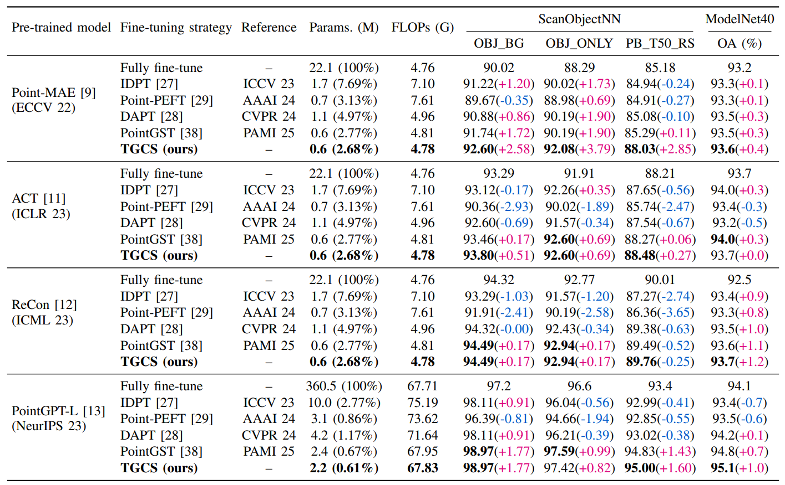
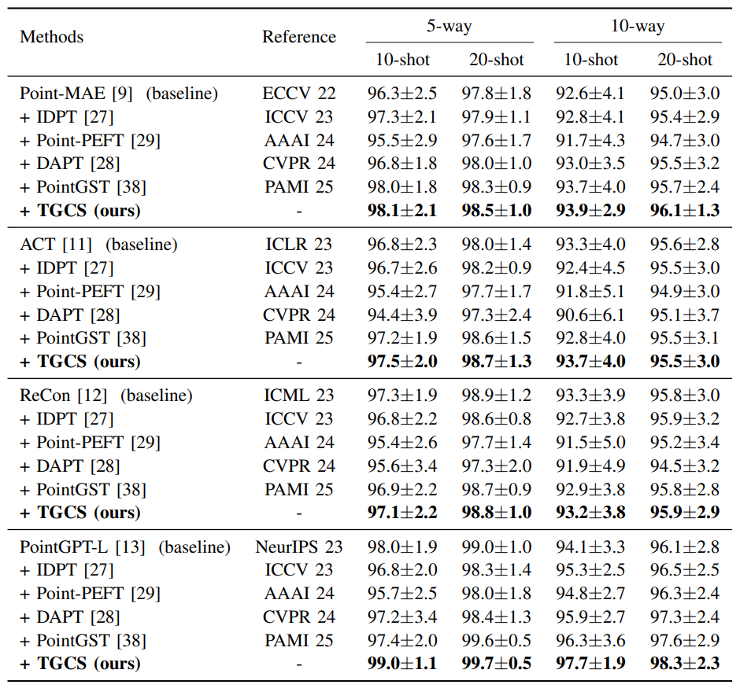

# TGCS: Parameter-Efffcient Topology-Guided Cross-Scale Adapter for Point Cloud Learning

# 1. Introduction
Recently, large-scale pre-training has become a dominant paradigm for improv-ing point cloud representations and enabling strong transfer to downstreamthree-dimensional (3D) tasks. However, adapting large pre-trained point-cloudtransformers in practice still often relies on full fine-tuning, which is storage-intensive and computationally demanding when multiple tasks or domains mustbe supported. Moreover, for real scans, the main obstacle is not only the param-eter budget but also the topology shift induced by density variation, occlusion,missing regions, and background clutter, which corrupts local neighborhoodsand makes token-level adaptation unstable. To address these issues, we pro-pose a novel parameter-efficient fine-tuning (PEFT) framework for point clouds,called TGCS (Topology-Guided Cross-Scale adapter). TGCS freezes the pre-trained backbone and introduces a lightweight, trainable tuning branch thatperforms topology-conditioned residual calibration across transformer blocks.The core idea is built on two observations: (1) under a frozen backbone, feature-space prompts and adapters may be misled by unreliable semantic tokenswhen neighborhood topology is distorted, and (2) topology corruption is inher-ently multi-scale, so effective tuning should couple explicit topology cues withcross-scale context. Concretely, TGCS combines Cross-Scale Token Mixing (CS-Mixing), Saliency-Aware Token Gating (SA-Gating), and a Topology-GuidedCross-Scale Adapter (TG-Adapter) that conditions residual updates on multi-scale topology descriptors computed from token anchors, including density anddispersion statistics as well as eigenvalue-derived local shape cues. Extensiveexperiments on ScanObjectNN, ModelNet40, and ShapeNetPart demonstratethat TGCS consistently improves the accuracy-efficiency trade-off across MAE-style and GPT-style backbones. Notably, with Point-MAE, TGCS tunes only 0.6M parameters (2.68%) yet improves the hardest ScanObjectNN setting PB_T50 RS from 85.18% to 88.03%. With the stronger PointGPT-L back-bone, TGCS achieves 98.97%, 97.42%, and 95.00% on 0BJ_BG, 0BJ_ONLY,and PB_T50_RS, respectively while tuning only 2.2M parameters, establishingthe state-of-the-art performance under an efficient fine-tuning regime. TGCS also yields stable gains in few-shot classification and preserves competitive part-segmentation mIoU with a compact tunable budget, validating topology-guided cross-scale conditioning as a practical solution for resource-efficient point cloud adaptation.


# 2. Experimental Environment
git clone https://github.com/ZhengLingxiang/TGCS.git

cd TGCS/


## 2.1 Requirements
```
conda create -y -n idpt python=3.7
conda activate idpt
pip install torch==1.8.0+cu111 torchvision==0.9.0+cu111 torchaudio==0.8.0 -f https://download.pytorch.org/whl/torch_stable.html
pip install -r requirements.txt

# Chamfer Distance & emd
cd ./extensions/chamfer_dist
python setup.py install --user
cd ./extensions/emd
python setup.py install --user

# PointNet++
pip install "git+https://github.com/erikwijmans/Pointnet2_PyTorch.git#egg=pointnet2_ops&subdirectory=pointnet2_ops_lib"

# GPU kNN
pip install --upgrade https://github.com/unlimblue/KNN_CUDA/releases/download/0.2/KNN_CUDA-0.2-py3-none-any.whl
pip install torch-scatter
```

## 2.2 Datasets
See [DATASET.md](DATASET.md) for details.

# 3. Main Results
<div align="center">
  
</div>

<div align="center">
  
</div>


<div align="center">

| Baseline              | Trainable Parameters | Dataset       | Config            | Acc.   | Download |
|-----------------------|----------------------|---------------|-------------------|--------|----------|
| Point-MAE (ECCV 22)   | 0.6M                 | ModelNet40    | [modelnet](cfgs/mae/tgcs_modelnet.yaml) | 93.6   | [ckpt](https://example.com/pointmae) |
|                       |                      | OBJ_BG        | [scan_objbg](cfgs/mae/tgcs_scan_objbg.yaml) | 92.60  | [ckpt](https://example.com/pointmae) |
|                       |                      | OBJ_ONLY      | [scan_objonly](cfgs/mae/tgcs_scan_objonly.yaml) | 92.08  | [ckpt](https://example.com/pointmae) |
|                       |                      | PB_T50_RS     | [scan_hardest](cfgs/mae/tgcs_scan_hardest.yaml) | 88.03  | [ckpt](https://example.com/pointmae) |
| ACT (ICLR 23)         | 0.6M                 | ModelNet40    | [modelnet](cfgs/act/tgcs_modelnet.yaml) | 93.7   | [ckpt](https://example.com/act) |
|                       |                      | OBJ_BG        | [scan_objbg](cfgs/act/tgcs_scan_objbg.yaml) | 93.80  | [ckpt](https://example.com/act) |
|                       |                      | OBJ_ONLY      | [scan_objonly](cfgs/act/tgcs_scan_objonly.yaml) | 92.60  | [ckpt](https://example.com/act) |
|                       |                      | PB_T50_RS     | [scan_hardest](cfgs/act/tgcs_scan_hardest.yaml) | 88.48  | [ckpt](https://example.com/act) |
| ReCon (ICML 23)       | 0.6M                 | ModelNet40    | [modelnet](cfgs/recon/tgcs_modelnet.yaml) | 93.7   | [ckpt](https://example.com/recon) |
|                       |                      | OBJ_BG        | [scan_objbg](cfgs/recon/tgcs_scan_objbg.yaml) | 94.49  | [ckpt](https://example.com/recon) |
|                       |                      | OBJ_ONLY      | [scan_objonly](cfgs/recon/tgcs_scan_objonly.yaml) | 92.94  | [ckpt](https://example.com/recon) |
|                       |                      | PB_T50_RS     | [scan_hardest](cfgs/recon/tgcs_scan_hardest.yaml) | 89.76  | [ckpt](https://example.com/recon) |
| PointGPT-L (NeurIPS 24) | 2.4M                | ModelNet40    | [modelnet](cfgs/gpt/tgcs_modelnet.yaml) | 95.1   | [ckpt](https://example.com/pointgpt) |
|                       |                      | OBJ_BG        | [scan_objbg](cfgs/gpt/tgcs_scan_objbg.yaml) | 98.97  | [ckpt](https://example.com/pointgpt) |
|                       |                      | OBJ_ONLY      | [scan_objonly](cfgs/gpt/tgcs_scan_objonly.yaml) | 97.42  | [ckpt](https://example.com/pointgpt) |
|                       |                      | PB_T50_RS     | [scan_hardest](cfgs/gpt/tgcs_scan_hardest.yaml) | 95.00  | [ckpt](https://example.com/pointgpt) |

</div>

